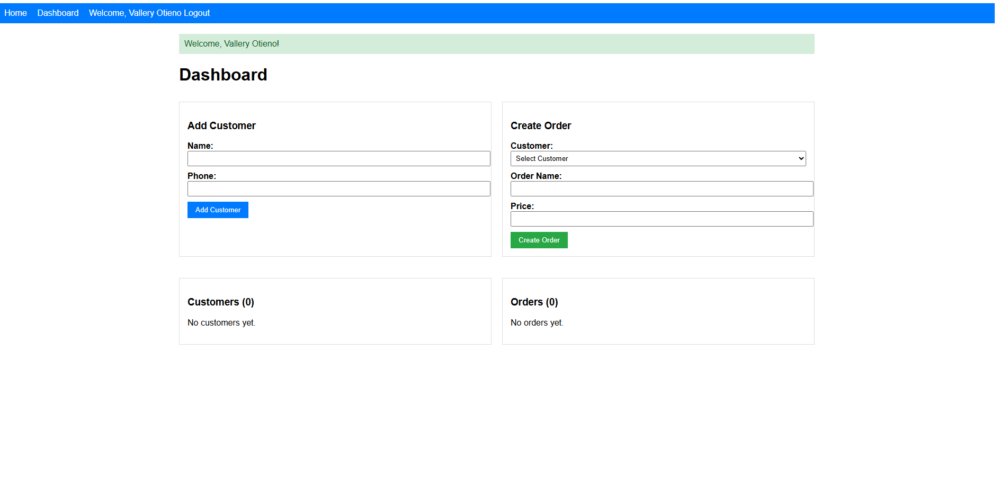

# Python-Orders-App

This is a backend service built with **Flask**, providing a REST API for managing customers and orders.  
It includes google OpenID Connect authentication, unit tests with coverage, Docker support, and a GitLab CI/CD pipeline.

---

## 📸 Dashboard Preview

---

## Features

- **Customer Management**: Add and retrieve customers.
- **Order Management**: Add and retrieve orders.
- **Authentication & Authorization**: OpenID Connect (Google OIDC).
- **Unit Testing & Coverage**: Pytest + coverage.
- **Dockerized**: Test and Build images to Docker Hub automatically.
- **GitLab CI/CD**: Automated test, build, deploy pipeline.

---

API ENDPOINTS

 POST --- `/api/customers` --- Create a customer
 GET ---  `/api/customers` --- List customers    
 POST --- `/api/orders`  --- Create an order   
 GET --- `/api/orders` --- List orders       

